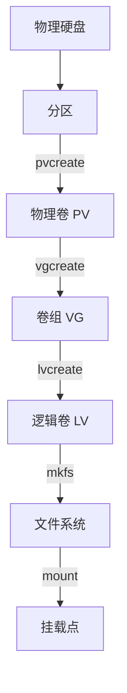

# Ubuntu 系统磁盘拓展指南

## 基本概念和术语

### 分区的基本概念
无论是 Linux 还是 Windows，都要把硬盘分成一块一块的区域来管理，Linux中这些区域就叫“分区”，Windows中叫卷（Volume）。就好比把一个大房间分成几个小房间，每个小房间可以放不同的东西。

- 主分区
主分区是硬盘上的独立分区，通常用于安装操作系统的核心组件。
例如：  
  - 根分区（/）：包含操作系统的所有基本文件和目录，是系统启动和运行的基础。  
  - 启动分区（/boot）：包含启动 Linux 系统所需的关键文件，如内核文件（vmlinuz）和启动加载器（grub）的相关文件。单独划分 /boot 分区可以提高系统的安全性和灵活性。  

- 扩展分区
扩展分区本身不能直接使用，它的主要作用是容纳逻辑分区。通过创建扩展分区，用户可以在硬盘上创建更多的逻辑分区，从而突破主分区数量的限制（一块硬盘最多只能有 4 个主分区）。扩展分区是创建逻辑分区的“容器”。  

- 逻辑分区
逻辑分区是在扩展分区上划分的分区，数量没有限制。它们通常用于存储用户数据或其他需要独立存储空间的目录。
例如：  
  - 用户数据分区（/home）：用于存储用户数据，包括个人文件和配置文件。单独划分 /home 分区可以保护用户数据，即使系统分区出现问题，用户数据也不会丢失。  
  - 临时文件分区（/tmp）：用于存储临时文件，这些文件在系统重启时通常会被清空。单独划分 /tmp 分区可以避免临时文件占用过多空间，影响系统性能。  
  - 交换分区（/swap）：是 Linux 系统的虚拟内存分区，当系统的物理内存不足时，交换分区会被用作临时存储空间。  


**Windows 卷 vs Linux 分区对比**

| 特性          | Windows 卷 (Volume) | Linux 分区 (Partition) |
|---------------|---------------------|------------------------|
| 术语          | 卷 (Volume)         | 分区 (Partition)       |
| 主分区        | 主卷                | 主分区                 |
| 扩展分区      | 扩展卷              | 扩展分区               |
| 逻辑分区      | 逻辑卷              | 逻辑分区               |
| 文件系统      | NTFS/FAT32/exFAT    | ext4/xfs/btrfs         |
| 挂载方式      | 驱动器号 (C:, D:等) | 挂载点 (如 `/mnt`)     |
| 扩展性        | 需转换为动态磁盘    | 原生支持 LVM 动态扩展  |
| 管理工具      | 磁盘管理            | `fdisk`/`parted`/`gparted` |

传统分区结构示例：  
<pre>
┌─────────────┐
│  主分区1    │ ← /boot
├─────────────┤
│  主分区2    │ ← /
├─────────────┤
│  扩展分区   │
│ ┌─────────┐ │
│ │逻辑分区1│ │ ← /home
│ ├─────────┤ │
│ │逻辑分区2│ │ ← /swap
│ └─────────┘ │
└─────────────┘
</pre>


### LVM基本概念和术语
1. 物理存储介质：  
指的是物理的硬盘，在`/dev`目录下看到的`sda`，`sdb`，`sdc`，`hda`，`hdb`，`hdc`等  

2. 分区：
分区是硬盘上的一个独立区域，用于存储数据，分区可以被初始化为物理卷（PV）  

2. 物理卷（Pisical Volume）：  
指的是物理硬盘上的分区或逻辑上与磁盘分区具有相同功能能的设备，是LVM的基本存储块，但和分区来比，却包含了与LVM管理相关的参数。这个就是前面讲的存储池  

3. 卷组（Volume Group）：  
LVM的卷组类似于物理硬盘，卷组上边可以建立多个虚拟的“分区”，LVM卷组由一个或多个物理卷组成  

4. 逻辑卷（Logical Volume）：  
LVM的逻辑卷类似于非LVM系统中的硬盘分区，在逻辑卷上边可以建立文件系统，用于mount到不同的挂载点，提升分区空间（这是真正跟用户打交道的部分）  

5. PE （Physical Extent）  
每一个物理卷被划分为一个个的基本存储单元，每一个PE都具有唯一的编址（这个东西类似于物理硬盘上的磁盘地址）。PE的大小默认为4MB  

6. LE（Logical Extent）  
每一个逻辑卷也被划分为一个个的基本存储单元，每一个LE也具有一个唯一的编址。在同一个卷组中，LE和PE的大小是相等的  

综上所述：一个或者多个物理硬盘上都可以划分出一个或者多个LVM分区，然后这些分区可以组成一个物理卷（PV），形成一个存储池。用 户把这个存储池划分出来一个或者多个逻辑卷（LV），挂载到不同的分区上去使用，这个就是LVM的基本原理，也是建立LVM的过程  

LVM 的层级关系图:  

传统分区 vs LVM 结构对比:
<pre>
# 传统分区
┌─────────────┐
│  /dev/sda1  │ ← /boot (固定大小)
├─────────────┤
│  /dev/sda2  │ ← / (无法动态扩展)
└─────────────┘

# LVM结构
┌─────────────┐     ┌─────────────┐
│  PV(sda1)   │     │  PV(sdb1)   │
└─────────────┘     └─────────────┘
        ↓               ↓
        └───────────────┘
                ↓
           [卷组 VG] ← 可动态添加PV
                ↓
        ┌───────┴───────┐
        ↓               ↓
┌─────────────┐ ┌─────────────┐
│ LV(root)    │ │ LV(home)    │ ← 可在线扩展
└─────────────┘ └─────────────┘
</pre>
关键优势对比：

| 特性          | 传统分区 (Traditional Partitioning) | LVM (Logical Volume Management) |
|---------------|-------------------------------------|----------------------------------|
| 扩展性        | 固定大小，难以调整                   | 动态调整，灵活扩展               |
| 多磁盘管理    | 独立管理，每块磁盘单独分区           | 统一存储池，整合多块磁盘         |
| 快照功能      | 不支持                               | 支持，可创建数据快照             |
| 复杂度        | 操作简单，易于上手                   | 需要学习相关概念，操作稍复杂     |
| 适用场景      | 适合简单分区需求                     | 适合需要灵活扩展和管理的场景     |


## 查看分区情况
1. **查看分区信息**：打开终端，输入以下命令查看分区情况：
```bash
sudo fdisk -l
```
  

或者：
```bash
sudo lsblk
```
  
这个命令会列出所有硬盘及其分区信息，包括分区大小、类型等。

2. **查看磁盘使用情况**：输入以下命令查看磁盘使用情况：
```bash
df -h
```
这个命令会显示已挂载分区的使用情况，包括总容量、已用空间、可用空间等。  
  


## 分区操作

### 创建新分区

这里我在原来磁盘的剩余空间中实现新建扩展分区并在扩展分区中创建逻辑分区并挂载到指定位置实现的扩容操作  
如果是新加一块磁盘可能需要执行下面的操作在进行扩容操作  
首先要扫描新硬件  
```bash
echo "- - -" > /sys/class/scsi_host/host0/scan
```

#### 1. **配置分区工具**：
进入分区工具：
```bash
sudo fdisk /dev/sda
```
  

**操作步骤**：
   - 输入 `m` 查看菜单，了解可用命令。
   - 输入 `p` 查看当前分区表，确认当前没有分区。
   - 输入 `n` 新建分区。
     - 选择主分区，输入 `p`。
        - 输入分区号，如 `3`。
        - 输入起始扇区号（例如 83884032），直接按回车，fdisk 会自动选择当前分区表中第一个可用的扇区作为起始扇区
        - 输入结束扇区号（例如 90000000），或者按回车使用所有剩余空间
     - 选择建立逻辑分区，输入 `l`。
        - 输入分区号，如 `5`。
        - 输入起始扇区号（例如 90000001），直接按回车，fdisk 会自动选择当前分区表中第一个可用的扇区作为起始扇区
        - 输入结束扇区号（例如 104857599），或者按回车使用所有剩余空间
   - 输入 `p` 打印分区表，确认新建的扩展分区
   - 输入 `w` 写入分区表并退出 fdisk 界面。

  

#### 2. **通知内核重新读取分区表**
如果格式化分区失败的话可以尝试通知内核重新读取分区表：
```
sudo partprobe /dev/sda
```

#### 3. **格式化分区**：
- 确认分区名称：使用 `fdisk -l` 或 `lsblk` 命令确认要格式化的分区名称，例如 `/dev/sda3`。
- 查看文件系统类型：在格式化之前，可以查看当前分区的文件系统类型（如果已经格式化过）：
```bash
sudo lsblk -f
```
或:
```bash
sudo blkid /dev/sda3
```
- 格式化分区：输入以下命令进行格式化（以 ext4 文件系统为例）：  
   ext4主要处理小文件：
```bash
sudo mkfs.ext4 /dev/sda3
```
  - 如果需要格式化为其他文件系统，例如 XFS，可以使用以下命令：
  xfs主要处理大文件：
```bash
sudo mkfs.xfs /dev/sda3
```

  


#### 4. **挂载分区**：
- 创建挂载点：在根目录下新建一个文件夹，作为挂载点，例如：
```bash
sudo mkdir -p /mnt/new_disk1
```
   - 建议使用 `/mnt` 或 `/media` 下的目录作为挂载点，这些目录通常用于挂载外部存储设备。
- 挂载分区：将分区挂载到新建的文件夹下：
```bash
sudo mount /dev/sda3 /mnt/new_disk1
```

- 查看挂载情况：输入以下命令查看挂载的磁盘：
```bash
df -h
```
   - 确认 `/dev/sda3` 已正确挂载到 `/mnt/new_disk1`。

  
  
  

#### 5. **设置开机自动挂载**
查看分区的 UUID：
```bash
blkid
```
记住`/dev/sdb1`的 UUID  
使用文本编辑器打开 `/etc/fstab` 文件  
```bash
sudo vim /etc/fstab
```
在fstab文件中添加：
```plaintext
UUID=xxxxxxxx-xxxx-xxxx-xxxx-xxxxxxxxxxxx /mnt/mynewdisk ext4 defaults 0 0
```
或
```plaintext
/dev/sdb1 /mnt/mynewdisk ext4 defaults 0 0
```
后保存退出  
解释说明：
- `UUID=xxxxxxxx-xxxx-xxxx-xxxx-xxxxxxxxxxxx`：分区的 UUID（唯一标识符），可以使用 `blkid` 命令获取。
- `/dev/sdb1`：新分区的设备路径。
- `/mnt/mynewdisk`：挂载点。
- `ext4`：文件系统类型（根据实际格式化类型填写，如 `xfs`）。
- `defaults`：默认挂载选项。
- `0`：表示该分区不需要被 `dump` 备份工具备份。
- `0`：表示在启动时会检查文件系统（1 表示根分区，2 表示其他分区，0 表示不检查）。
- 保存并退出文件：保存文件并退出编辑器。

  

- 重启系统以确保所有更改生效：
```bash
sudo reboot
```

#### 6. **删除分区**：
- **1.确认分区编号**
在删除分区之前，务必确认要删除的分区编号，以避免误操作。可以使用以下命令查看分区信息：
```bash
sudo fdisk -l
```
或者：
```bash
sudo lsblk
```
查看分区的 UUID：
```bash
blkid
```
这些命令会列出所有分区及其详细信息，包括分区编号、大小和挂载点。

- **2.取消挂载分区**
如果要删除的分区已经挂载，需要先取消挂载。使用以下命令取消挂载分区：
```bash
sudo umount /dev/sda3
```
如果分区正在被使用，系统会提示无法取消挂载。在这种情况下，需要先关闭使用该分区的程序或服务  
如果提示分区正在使用，可以强制取消挂载：
```bash
sudo umount -f /dev/sda3 
```

- **3.启动 fdisk**  
启动 `fdisk` 工具，指定要操作的磁盘设备：
```bash
sudo fdisk /dev/sda
```

- **4.删除分区**  
在 `fdisk` 界面中，执行以下操作：
1. 输入 `d`，表示删除分区。
2. 输入要删除的分区编号（例如 `3`，表示删除 `/dev/sda3`）。
3. 输入 `w`，保存更改并退出 `fdisk`。

  

- **5.更新内核分区表**  
删除分区后，运行以下命令确保内核同步：
```bash
sudo partprobe /dev/sda
```
或最彻底的方法：
```
sudo reboot
```

- **6.验证分区是否删除**  
退出 `fdisk` 后，再次运行以下命令确认分区是否已被删除：
```bash
sudo fdisk -l
```
或者：
```bash
sudo lsblk
```
如果分区已经被删除，将不再显示在列表中。

删除分区后如果想要重新创建一般会出现下面信息：
<pre>
命令(输入 m 获取帮助)： n
分区类型
   p   主分区 (1个主分区，1个扩展分区，2空闲)
   l   逻辑分区 (从 5 开始编号)
选择 (默认 p)： p
分区号 (3,4, 默认  3): 3
第一个扇区 (83884032-104857599, 默认 83884032): 
Last sector, +/-sectors or +/-size{K,M,G,T,P} (83884032-104857599, 默认 104857599): 

创建了一个新分区 3，类型为“Linux”，大小为 10 GiB。
分区 #3 包含一个 ext4 签名。

您想移除该签名吗？ 是[Y]/否[N]： 
</pre>
直接输入 Y 并回车，fdisk 会自动清除该区域的签名，无需额外操作  
这种提示的出现是为了确保用户在创建新分区时，不会因为旧的文件系统签名而产生混淆或错误  


### 扩展现有分区
在使用MSDOS分区表的情况下，Ubuntu（以及大多数使用MSDOS分区表的Linux系统）需要先对扩展分区扩容，然后才能对其中的逻辑分区扩容  
确认分区编号：
```bash
sudo fdisk -l
```
启动 parted：
```bash
sudo parted /dev/sda
```
查看当前分区表：
```bash
print free
```
<pre>
(parted) print free
型号：VMware, VMware Virtual S (scsi)
磁盘 /dev/sda: 53.7GB
扇区大小 (逻辑/物理)：512B/512B
分区表：msdos
磁盘标志：

编号  起始点  结束点  大小    类型      文件系统  标志
      1024B   1049kB  1048kB            可用空间
 1    1049kB  538MB   537MB   primary   fat32     启动
      538MB   539MB   1048kB            可用空间
 2    539MB   42.9GB  42.4GB  extended
 5    539MB   42.9GB  42.4GB  logical   ext4
      42.9GB  53.7GB  10.7GB            可用空间
</pre>
primary：主分区
extended：扩展分区
logical：逻辑分区

#### 先对扩展分区扩容：
```bash
resizepart 2
```
确认：
```
yes
```
指定分区大小：
```
53.7GB
```
查看当前分区表：
```bash
print free
```
<pre>
(parted) print free                                                       
型号：VMware, VMware Virtual S (scsi)
磁盘 /dev/sda: 53.7GB
扇区大小 (逻辑/物理)：512B/512B
分区表：msdos
磁盘标志：

编号  起始点  结束点  大小    类型      文件系统  标志
      1024B   1049kB  1048kB            可用空间
 1    1049kB  538MB   537MB   primary   fat32     启动
      538MB   539MB   1048kB            可用空间
 2    539MB   53.7GB  53.1GB  extended
 5    539MB   42.9GB  42.4GB  logical   ext4
      42.9GB  53.7GB  10.7GB            可用空间
</pre>

#### 再对逻辑分区扩容：
```bash
resizepart 5
```
确认：
```
yes
```
指定分区大小：
```
53.7GB
```
查看当前分区表：
```bash
print free
```
<pre>
(parted) print free                                                       
型号：VMware, VMware Virtual S (scsi)
磁盘 /dev/sda: 53.7GB
扇区大小 (逻辑/物理)：512B/512B
分区表：msdos
磁盘标志：

编号  起始点  结束点  大小    类型      文件系统  标志
      1024B   1049kB  1048kB            可用空间
 1    1049kB  538MB   537MB   primary   fat32     启动
      538MB   539MB   1048kB            可用空间
 2    539MB   53.7GB  53.1GB  extended
 5    539MB   53.7GB  53.1GB  logical   ext4
</pre>
退出 parted：
```bash
quit
```

  

调整文件系统大小：
- 对于 ext4 文件系统：
```bash
sudo resize2fs /dev/sda5
```
- 对于 xfs 文件系统：
```bash
sudo xfs_growfs /mnt/sda5
```
  


检查当前的挂载点:
```bash
df -h
```
在更新 `/etc/fstab` 文件后，建议重新挂载分区以确保一切正常：
```bash
sudo mount -a
```
验证调整结果:
```bash
df -h
```
注意扩容完成之后无法再缩小分区，只能扩大分区。

  

#### **常见错误及解决方法**  
如果分区表损坏，可以使用 `parted` 重新创建分区表：
```bash
sudo parted /dev/sda
```
在 parted 界面中，输入以下命令：
```bash
mklabel msdos
```
这将创建一个新的 DOS 分区表，覆盖旧的分区表


###  新增磁盘使用LVM扩容
添加新的硬盘：  
  
  
  
  
  

#### 1. 先安装 LVM 工具
```bash
sudo apt update
sudo apt install lvm2
```

#### 2. 扫描新硬件
```bash
echo "- - -" > /sys/class/scsi_host/host0/scan
```
  

#### 3. 找出你将要使用的磁盘：  
```bash
sudo fdisk -l
```
或
```bash
sudo lsblk
```

#### 4. 使用 fdisk 命令创建需要合并的分区：
```bash
sudo fdisk /dev/sda
```
```bash
sudo fdisk /dev/sdb
```
步骤:  
- `n` = 创建新分区  
- `p` = 创建主分区  
- `1` = 成为磁盘上的首个分区  
输入两次  enter 键扩展到使用所有可用的空闲空间  

更改分区类型：
- `t` = 更改分区类型  
- `8e` = 更改为 LVM 分区类型  

核实信息并写入硬盘：
- `p` = 查看分区设置
- `w` = 写入到磁盘

  
  

#### 5. 通知内核重新读取分区表：
```bash
sudo partprobe /dev/sda
```
```bash
sudo partprobe /dev/sdb
```

#### 6. 将新分区初始化为物理卷（PV）
```bash
sudo pvcreate /dev/sda3
```
```bash
sudo pvcreate /dev/sdb1
```
如果想要取消则输入：
```bash
sudo pvremove /dev/sdb1
```
查看物理卷（PV）信息
```bash
sudo pvdisplay
```
或
```bash
pvs
```
  

#### 7. 确认卷组名称  
在执行 vgextend 之前，确认系统中存在的卷组名称：
```bash
sudo vgdisplay
```
或
```bash
vgs
```
如果系统中没有卷组，您需要创建一个新的卷组。如果存在卷组，记下卷组的名称  

#### 8. 创建新的卷组(如果卷组不存在)  
命令格式如下：
```bash
sudo vgcreate <卷组名> <物理卷设备>
```
例如：
```bash
sudo vgcreate ubuntu-vg /dev/sda3
```
如果要删除卷组：
```bash
sudo vgremove <卷组名>
```
例如：
```bash
sudo vgremove ubuntu-vg
```
  

#### 9. 将新物理卷加入卷组（VG）
```bash
sudo vgextend ubuntu-vg /dev/sdb1
```
如果想要取消则输入：
```bash
sudo vgreduce ubuntu-vg /dev/sdb1
```
查看vg的扩容前后对比
```bash
sudo vgdisplay
```
或
```bash
vgs
```


#### 10. 创建逻辑卷（LV）  
使用所有可用空间创建逻辑卷
```bash
sudo lvcreate -l +100%FREE -n root ubuntu-vg
```
- `lvcreate`：用于创建逻辑卷的命令
- `-l +100%FREE`：指定逻辑卷的大小。-l 表示基于物理扩展（PE）的数量来分配空间，+100%FREE 表示使用卷组中所有可用的空闲空间
- `-n root`：指定逻辑卷的名称为 root
- `ubuntu-vg`：指定卷组的名称

指定固定大小创建逻辑卷
```bash
sudo lvcreate -L 20G -n root ubuntu-vg
```
- `-L 20G`：指定逻辑卷的大小为 20GB。
- `-n root`：指定逻辑卷的名称为 root。
- `ubuntu-vg`：卷组的名称。

删除逻辑卷
在删除逻辑卷之前，必须确保它没有被挂载:
```bash
sudo umount /dev/ubuntu-vg/root
```
运行以下命令删除逻辑卷：
```bash
sudo lvremove /dev/ubuntu-vg/root
```

#### 11. 格式化逻辑卷
对于 ext4 文件系统：
```bash
sudo mkfs.ext4 /dev/ubuntu-vg/root
```
对于 XFS 文件系统：
```bash
sudo mkfs.xfs /dev/ubuntu-vg/root
```

#### 12. 挂载逻辑卷
```bash
sudo mkdir -p /mnt/newlv
sudo mount /dev/ubuntu-vg/root /mnt/newlv
```
  

#### 13. 扩展逻辑卷（LV）
检查LV路径:
```bash
sudo lvdisplay
```
或
```bash
lvs
```
假设需要扩展的逻辑卷路径为 `/dev/ubuntu-vg/root` 将其扩展到使用所有可用空间：
```bash
sudo lvextend -l +100%FREE /dev/ubuntu-vg/root
```
- `-l`：指定扩展的大小基于物理扩展（PE）的数量。
- `+100%FREE`：表示将逻辑卷扩展到使用所有可用的空闲空间。
- `/dev/ubuntu-vg/root`：目标`逻辑卷`的路径。

使用 -L 参数（指定固定大小）：
```bash
sudo lvextend -L +20G /dev/ubuntu-vg/root
```
- `-L`：指定扩展的大小为一个固定的值。
- `+20G`：表示将逻辑卷的大小增加 20GB。如果需要指定其他单位，可以使用 M（兆字节）、G（吉字节）、T（太字节）等。
- `/dev/ubuntu-vg/root`：目标逻辑卷的路径。

#### 14. 刷新逻辑卷（LV）的空间，使其生效
```bash
lvscan
```

#### 15. 调整文件系统大小  
对于 ext4 文件系统：
```bash
sudo resize2fs /dev/ubuntu-vg/root
```
对于 XFS 文件系统：
```bash
sudo xfs_growfs /dev/ubuntu-vg/root
```

#### 16. 验证扩容结果
```bash
df -h
```
```bash
sudo lsblk
```
  

### 注意事项
1. **备份数据**
   - 在删除分区之前，建议备份重要数据，以防操作过程中出现意外导致数据丢失。

2. **确认分区编号**
   - 在操作前仔细确认分区编号，避免误操作。

3. **检查分区使用情况**
   - 在取消挂载分区之前，可以使用以下命令检查分区是否正在被使用：
```bash
sudo lsof | grep /mnt/new_disk1
```
如果有进程正在使用该分区，需要先关闭这些进程。

4. **分区大小计算**
   - 分区大小的计算方法为：
     \[
     \text{分区大小（MB）} = \frac{\text{End} - \text{Start} + 1}{2048}
     \]
     - `Start` 和 `End` 是分区的起始和结束扇区号，单位为扇区（每个扇区 512 字节）。

5. **主分区和扩展分区**
   - 一般情况下，系统盘会包含一个主分区（用于安装系统）和一个扩展分区（用于逻辑分区）。对于新增的非系统盘，可以直接划分为逻辑分区，无需主分区。

6. **文件系统选择**
   - 选择文件系统时，`ext4` 是最常用的文件系统，适用于大多数场景；`xfs` 适用于大容量存储和高性能需求的场景。

7. **查看文件系统类型**
   - 在操作过程中，可以随时使用以下命令查看分区的文件系统类型：
```bash
sudo lsblk -f
```
这个命令会列出所有分区及其文件系统类型，帮助你确认分区状态。


### 验证和清理
1. **检查文件系统状态**：在扩容操作完成后，建议检查文件系统状态（建议在未挂载时进行）：
```bash
sudo umount /mnt/new_disk
sudo fsck /dev/sda3
sudo mount /dev/sda3 /mnt/new_disk
```
   - 注意：`fsck` 通常用于未挂载的文件系统。如果文件系统已经挂载，运行 `fsck` 可能会导致数据丢失或其他问题。因此，建议在单用户模式或从 Live CD/USB 启动时运行 `fsck`。
2. **清理临时文件**：扩容完成后，清理系统中的临时文件，释放空间：
```bash
sudo rm -rf /tmp/*
```

### 备份数据
在进行任何磁盘操作之前，建议备份重要数据，以防操作过程中出现意外导致数据丢失。可以使用以下命令备份数据：
```bash
sudo tar -czvf backup.tar.gz /path/to/important/data
```
